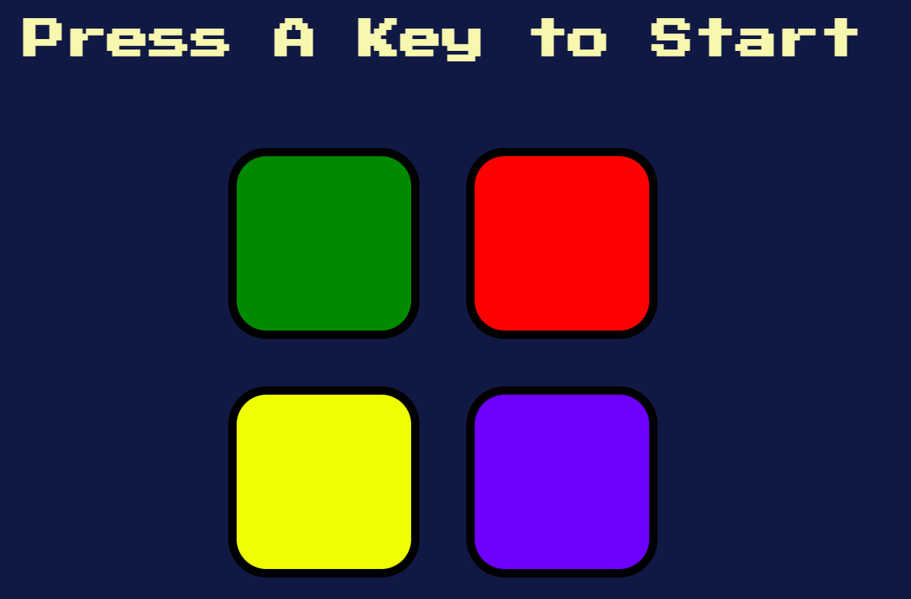

# 🎮 Simon Game

A classic memory game recreated using **HTML**, **CSS**, **JavaScript**, and **jQuery** as part of my web development learning journey.

## 📌 How It Works

The game generates a random color sequence.  
Your goal? Repeat the pattern by clicking the buttons in the correct order.

Each level adds a new color, and the game continues until you make a mistake.

## 🧠 What I Learned

- DOM manipulation with **jQuery**
- Handling **user input** through click events
- Using **arrays** to store and compare patterns
- Adding **sound effects** and simple **animations**
- Managing game state: start, play, fail, restart

## 💻 Tech Stack

- HTML5
- CSS3
- JavaScript (ES6)
- jQuery

## 🚀 Live Demo

👉 [Click here to play the game](https://your-username.github.io/simon-game/)  

## 📂 Folder Structure
- index.html
- styles.css
- games.js
- /sounds (audio files)

## 👩‍💻 About This Project

This project was built as part of my learning journey through [Angela Yu’s Web Development Bootcamp](https://www.udemy.com/course/the-complete-web-development-bootcamp/), to strengthen my understanding of frontend logic, interactivity, and DOM manipulation.

It’s one of the first projects that helped me apply real JavaScript concepts — tracking game state, handling user input, using arrays for logic, and adding animations and sounds.

Building this game gave me confidence to move from static sites to interactive web apps — and I'm excited to keep going!

## 🖼️ Preview

